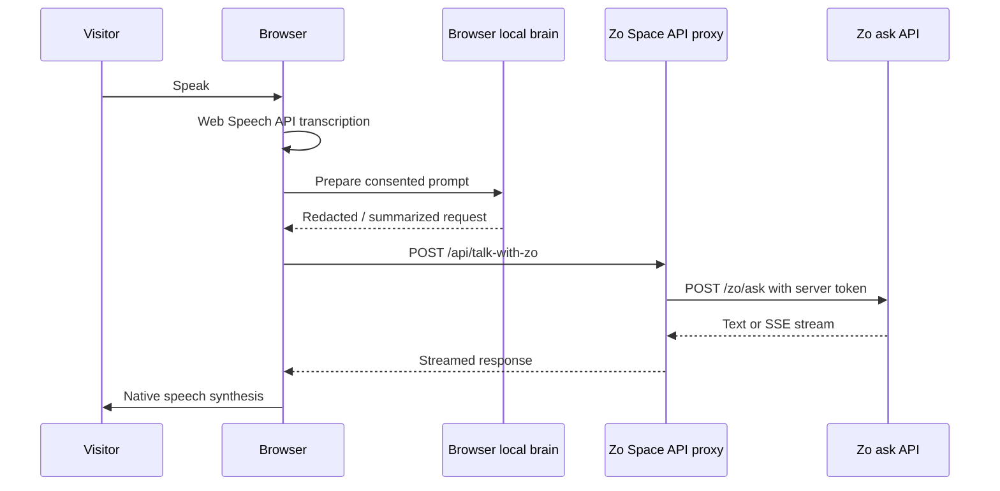

# Talk With Your Zo

Zo Space demo that lets visitors speak to Zo through the browser and the Zo ask API.

## Live Routes

- Page: `https://etok.zo.space/talk-with-zo`
- API proxy: `https://etok.zo.space/api/talk-with-zo`

## Architecture

## Privacy Model

- Browser transcription uses native Web Speech APIs for fast voice input.
- Browser-local prompt preparation keeps the visible transcript and redaction logic on the visitor device.
- The Zo API token never enters the browser. It is read only by the Zo Space API route from `ZO_API_KEY`.
- Demo mode sends one prepared utterance at a time. No persistent browser storage is used.

## Iteration Plan

1. MVP: native speech recognition, secure proxy, streaming response reader, native TTS.
2. Add optional WebLLM worker as the local conversational brain for summarization and private memory.
3. Add session mode with in-memory `conversation_id`, explicit reset, and visitor consent copy.
4. Add visual QA and browser compatibility fallbacks.

## Local Mirror

This repo mirrors the deployed Zo Space route source. Zo Space routes do not run from this filesystem directly; deploy through Zo Space route tools, then keep this repo committed and pushed.
